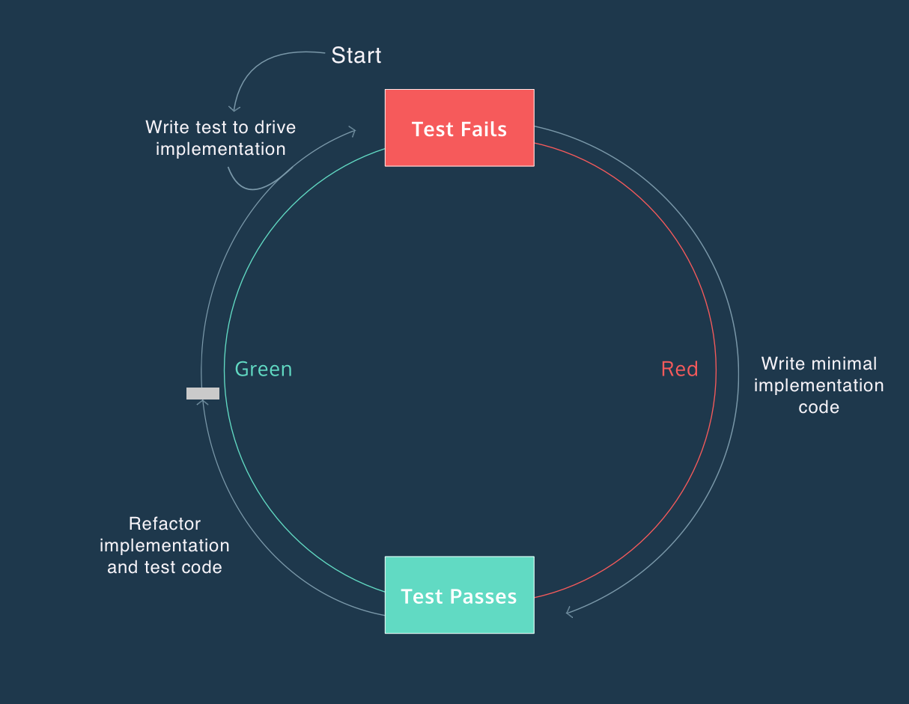

### About
Collection of classic math and JS problems solved using TDD approach. 
### Contribute
Since I mastering JS using described approach, some unit-tests fails, so you can collaborate using pull requests with refactoring and algorithm performance optimization. It would be great if you add new challange problem, but try to cover source with `TDD` and `JSDoc` first. Suck or you have any question, just let me know. 
### Docker
Project contain many features related to `Docker` in appropriate files. For example [Dockerfile](https://github.com/storenth/mochaTddDemo/blob/master/Dockerfile) shows how to wrap tests into container and run it on any linux based node.
### Getting started
```
git clone
npm install
npm test
```
Carefully read the rest of the readme then explore [`public`](https://github.com/storenth/mochaTddDemo/tree/master/public) and [`test`](https://github.com/storenth/mochaTddDemo/tree/master/test) directories.
### Custome setup
* Initiate [`package.json`](https://github.com/storenth/mochaTddDemo/blob/master/package.json) that can be used to manage packages for the project
```
npm init
```
* Install mocha framework and include it to the package.json
```
npm install mocha -D
```
* Add next script to the package.json
```
"scripts": {
  "test": "mocha"
}
```
* Now you can call Mocha with the following command:
```
npm test
```
### Solve any problem
* **Test-driven development** (TDD) is a programming technique where you write test code before implementation code. Test code is written to define the desired behavior of your program. The test output provides descriptive error messages that inform the implementation of your program. In TDD we react to the error messages by continually re-writing our implementation code so it behaves in the way that our test specifies. 
* For example I need solve simple `sum` function: I create `sum.js` file in `./public` and `sum_test.js` inside `./test` directory and start work with  **The Red-Green-Refactor Cycle**  
```
// sum.js
const sum = () => {};
module.exports = sum;
```


* In Mocha we group [tests](https://github.com/storenth/mochaTddDemo/blob/master/test/index_test.js) using the `describe` function and define tests using the `it` function. These two functions can be used to make your test suite *complete*, *maintainable*, and *expressive*.
*  nest `describe` blocks inside parent `describe` to resemble the structure of your implementation code and write individual tests in `it` blocks. This makes your test suite *isolated*, *maintainable*, and *expressive*.
* separating a test into **setup**, **exercise**, and **verify** phases. This distinct and well-defined separation of steps makes your test more *reliable*, *maintainable*, and *expressive*. use the `assert` method provided by Node.js. As a Node module, assert can be imported at the top of your files with  `const assert = require('assert');`. 
Some tests require a fourth phase called **teardown**. This step makes your test *isolated*. *Teardown* - reset any conditions that were changed during the test. The *teardown* phase is used to reset the environment before the next test runs.
* An *expressive* test is easy to read and descriptive, making it useful as a form of documentation for your implementation code. One way to make a test more expressive is clarifying its **verify** phase — the step where expected outcome is compared to actual outcome.
* If you need to compare the values within two objects, you can use `assert.deepEqual()`. This method compares the values of each object using loose (==) equality.
* Learn more about assertion https://nodejs.org/api/assert.html
* You will next test that implementation function throws an error if its argument is not a valid argument (less than 0 or greater, or not string as input value, etc.). Test both **bounds** (boundary values) to make your test suite complete. Test each bound in a separate `it` block to make it *maintainable*.
*  https://mochajs.org/#hooks 
* run specific test/suits meets describe/it patern`mocha -g 'return 0'`
```
// sum_test.js
describe('hooks', function() {
  before(function() {
    // runs before all tests in this block
  });

  after(function() {
    // runs after all tests in this block
  });

  beforeEach(function() {
    // runs before each test in this block
  });

  afterEach(function() {
    // runs after each test in this block
  });

  // test cases
});
```
* **Edge Case**
Now that we have written and refactored a few tests, it’s time to consider edge cases.
An edge case is a problem or situation that occurs only at an extreme (maximum or minimum) operating parameter — you can think of these as special cases that you need to account for like not expected input variables.

### Resources
1. Google [JS style guide](https://google.github.io/styleguide/jsguide.html#jsdoc)